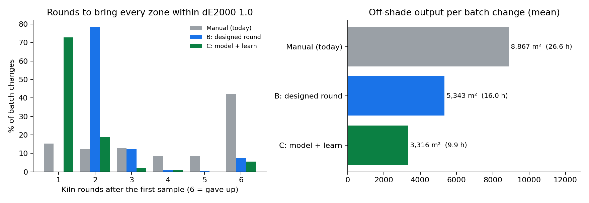
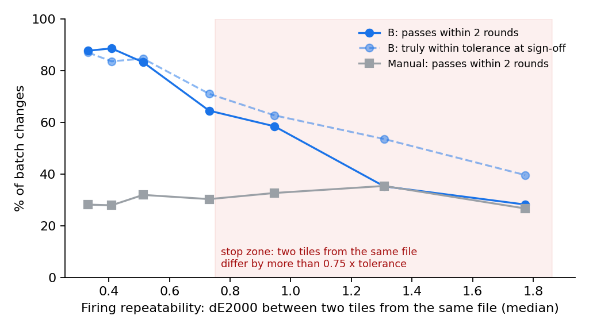
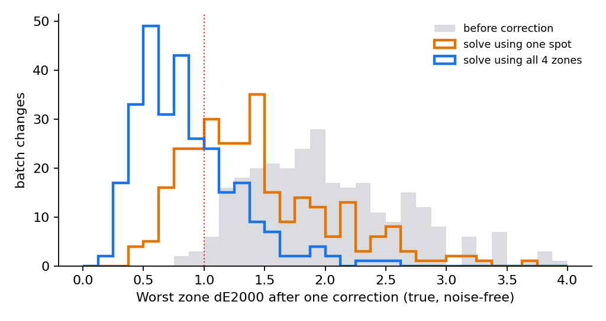

# Right-first-time shade at batch change
**Client A, ceramic tiles · Forward Deployed Engineer case study · prepared after discovery call 1 · 3 Oct 2026**

> **The short version.** The client asked for a vision system that compares the master tile with a production tile and says what to change in the print file. They already have the comparison: their lab spectrophotometer gives ΔL, Δa, Δb today. What they lack is the **translation from a colour difference into a file change that works for *this* batch**. Today they guess that translation one channel at a time, which costs 6–7 hours per kiln round and thousands of m² of off-shade tiles.
>
> **Their lab already runs the experiment every round, and throws the answer away.** I propose that the **6–7 variant tiles they already print per lab round become a designed experiment**: the current file, plus each ink channel nudged once. One kiln pass then measures how this batch responds to each ink, and a small solver gives the correction for every colour zone at once. No new hardware, no change to the printer, and QC still signs off. In a simulation of 400 batch changes, the share fixed within two rounds rises from **28% to 78%** on day one, and to **92%** once three months of logged rounds train a prior model. Mean off-shade output per batch change falls from **~8,900 m² to ~5,300 m² (and ~3,300 m² later)**.
>
> Two honest limits. A decision in minutes is achievable, but one kiln pass can't be skipped, because the colour forms in the kiln. And the whole idea fails if the kiln can't repeat itself, so that is the first thing the pilot measures (week 2), with a stop rule.

---

## 1. Problem understanding

**What they asked for, and what they need.**

| They asked for | What they actually need | Why the difference matters |
|---|---|---|
| A video / vision analytics system comparing master and production tile | A measured **inverse**: from ΔLab to a file change, valid for the current batch | Measurement is not the bottleneck. Their spectro already does it better than a camera on a glossy, textured tile. |
| A fix in minutes rather than hours | **Fewer kiln rounds** at batch change. The cost is off-shade m² produced while they iterate. | Each round is a kiln pass (~1 h in the kiln, 6–7 h door to door). Compute time is irrelevant, and rounds are what matter. |
| Advice on how much to change the input file | Changes applied to the **original** master file, from a **stored numeric master** | They correct already-corrected files (they suspect a reference set years ago has drifted well off). Every round adds to that drift. |
| A system that works on the line | A tool used **once per batch change** in the lab | They told us that once a batch's first sample is right, the rest of the batch runs fine. |
| (unstated) | Sign-off on **numbers, not eyes** | They told us different people judge shade differently, and near-misses sometimes get accepted. |

**Stakeholders and what each needs to hear.**

| Who | Role in the deal | What they need from us |
|---|---|---|
| Special Projects Lead, Procurement (did most of the talking) | Champion. Has to show internally that it can be done. | A proof on *their* tiles within weeks. A low fixed price. A clear stop point. |
| Head of IT & OT Procurement | Vendor risk, hardware, OEMs, site deployment | **No new hardware** for the pilot. Nothing writes to the printer. It runs on a lab PC on site. We can get people to the UAE plant. |
| Plant QC / lab team (*not on the call: the real users*) | Run the loop today and own the judgement | Fewer re-fires. They keep the sign-off. The tool shows its working ("brown +9%"), not a black box. |
| Design team | Owns print files and Photoshop edits | Original files are never overwritten. Every correction can be traced and undone. |
| Plant / production manager | Line uptime, off-shade m² | No extra kiln slots. Fewer m² downgraded. |
| Printer OEM / ink supplier | Controls RIP, warranty; may sell a competing colour management tool | We stay vendor-neutral and touch only files, never the machine. |

**As-is process (from the notes).** Production target set → the printer holds the reference image (the last run's sample + the master) → first sample printed and fired → lab compares it with the master (spectro ΔL Δa Δb, plus eye) → **pass:** run the batch → **fail:** someone edits the file in Photoshop (one of 6 colour channels, e.g. raising brown by a few percent) and makes 6–7 variants → print, fire, measure → repeat until it matches or is close enough → the line keeps running throughout: **5,000–10,000 m² in the wrong shade** (audio unclear) and **6–7 h per round**.

**A cross-check on their numbers.** A typical roller kiln line runs about 8,000 m²/day (≈333 m²/h). At 6.5 h per round, the quoted 5–10k m² means **2.3–4.6 rounds per batch change**. My simulation of their manual loop lands at 4.1 rounds and 8,900 m². The story holds together.

## 2. What I don't know yet: questions for call 2, ranked

| # | Question | Why it matters | What I assume until answered |
|---|---|---|---|
| 1 | **If you print the same file on 5 tiles in one kiln pass, how far apart are they (ΔE)?** And how big is the shift at a batch change? | If the kiln can't repeat itself, no file correction can be judged, and the whole approach fails (see §5, stop rule). | Tile-to-tile ≤ 0.5 ΔE2000. Batch-change shift 1.5–3 ΔE2000. |
| 2 | **What exactly changes at a "batch change"** (body, glaze or ink lot, kiln setting, SKU switch)? Can the new batch's material be sampled *before* the changeover? | It sets the kind of drift. If early sampling is possible, the correction can be finished before the line switches, which means ~0 off-shade m². | A new raw-material/glaze lot when an SKU is re-run. No early sampling today. |
| 3 | **Which printers and RIP, and how is the file edited?** (multichannel TIFF/PSD? which 6 channels? global channel changes or local edits? is there a colour-management module, e.g. EFI Fiery or ColorGATE, that nobody uses?) | It decides the output format, and whether to **configure what they own** before building anything. | 6-channel files with global per-channel edits. No repeat-job colour management in use. |
| 4 | **What is the pass mark and who signs off?** (ΔE formula and limit, per-zone or whole tile, gloss limit, spectro model, where on a patterned tile they measure) | It defines success. Today "close enough" has no definition. | ΔE2000 (or CMC) ≤ 1.0 on each measured zone. Gloss ±5 GU at 60°. A d/8° spectro. One spot per tile. |
| 5 | **Do logs of past lab rounds exist, and what is an off-shade m² worth?** (variants tried + readings; downgrade price vs scrap vs separate shade lot) | Logs bring forward the stronger method (C). The downgrade value *is* the business case. | Partial Excel logs exist. Off-shade tiles lose ~30% of a ~$6/m² price. |

Further questions (appendix A): batch changes per line per month and number of lines; who in QC and design joins call 2; IT/OT rules (cloud vs on-prem); printer OEM relationship and warranty; how the physical masters are stored and whether they have been measured; whether gloss comes from a printed digital-glaze channel.

## 3. Solution

**Options considered.**

| Option | Verdict | Reason |
|---|---|---|
| A. Inline camera / "video analytics" | **Not now** | Solves measurement, which already works. Camera colour on glossy, textured tile is worse than a spectro. Adds hardware, and still doesn't say *what to change*. Possible phase 3, for 100% shade sorting. |
| B. Buy or enable a commercial ceramic colour-management system (Durst/ColorGATE "Fingerprint", which claims 0–2 test runs; EFI Fiery proServer) | **Check first, in week 1** | It may already be licensed and unused. If so, enabling it is the cheapest answer and I'll say so. Downsides: tied to the printer brand, needs chart profiling and its own measuring hardware, plus a licence fee. It doesn't remove the process and adoption work. |
| C. Full spectral physics model (Kubelka–Munk per ink) | Partly reused in phase 2 | Accurate, but every batch shifts it anyway, so it still needs a measurement per batch. |
| D. Machine learning on historical rounds | Phase 2 (as method C below) | Clean history probably doesn't exist (edits on top of edits, unlogged variants). The pilot creates it. |
| E. Root-cause process control (kiln, raw material) | **Not building** | The client put it out of scope for now. We log batch metadata so a later root-cause study has data. |
| **F. Designed round + solver → model + learn** | **Recommended** | Uses their spectro, their 7-tile round and their files. No hardware. Works on day one without history and gets better with every batch change. |

**Why F fits this client.** Every round today, they already print 6–7 variants and fire them in one kiln pass. The variants are all guesses on *one* channel, so each round teaches almost nothing. If the same 7 tiles are **the current file plus each of the 6 channels nudged by +30%**, that round measures the batch's response to every ink in every colour zone (the local Jacobian, a 12×6 matrix for 4 zones). A bounded least-squares solve then gives the smallest file change that moves **all zones** onto the master together. Round 2 is a confirmation (the solution plus ±15%). Once ~3 months of rounds are logged (method C), a fitted model proposes the correction straight from the first-sample reading, **in minutes, with no kiln**. Round 1 prints that guess *and* the six nudges around it, so even a miss teaches the solver.

**Prototype evidence** (synthetic: a 6-ink Kubelka–Munk print-and-fire simulator with batch drift, firing noise and spectro noise; 400 batch changes; pass = every zone ≤ 1.0 ΔE2000; full method in appendix B):



| Per batch change that needed correcting | Manual (today, simulated) | **B: designed round** (pilot, day 1) | **C: model + learn** (after ~3 months) |
|---|---|---|---|
| Fixed within 2 kiln rounds | 28% | **78%** | **92%** (73% in 1 round) |
| Mean rounds / hours | 4.1 / 26.6 h | 2.5 / 16.0 h | 1.5 / 9.9 h |
| Never fixed (team accepts a near-miss) | 37% | 7% | 6% |
| **Truly** within tolerance at sign-off | 30% | 83% | 89% |
| Off-shade output | ~8,900 m² | ~5,300 m² | ~3,300 m² |
| Test tiles fired | 30 | 12 | 10 |

Three findings from the prototype changed the design:

1. **Measure every colour zone, not one spot.** Solving from a single spectro spot fixes only that spot: 26% of batch changes in tolerance after one correction, against 70% using all 4 zones (fig. B2). This probably explains "it looked right in the lab and wrong on the floor".
2. **Manual "passes" are often false.** Picking the best of 7 noisy tiles flatters the winner. In the simulation, only 30% of manually approved files are truly in tolerance. So the pilot re-measures approved tiles blind.
3. **The test nudge must be bigger than the firing noise.** At +10% the estimate drowns in noise (51% fixed within 2 rounds). At +30% it reaches 78%. A real design choice that only showed up by building it.
4. **It isn't about skill.** A simulated technician who *always* picks the right channel still fixes only 44% within 2 rounds. One channel per round is the bottleneck, not the person, and that is how I'll put it to the QC team.
5. **The designed round is for real misses.** If the drift is half what I assumed, B produces *more* off-shade than manual (4,400 vs 3,600 m²), because it spends one round measuring. Rule: run the designed round only when the first sample is > 1.5 ΔE2000 off, and move to C as soon as the logs allow. C beats manual at half and at double the drift (`robustness.py`).

**The biggest win needs no software: take the loop off the critical path.** If the new batch's body or glaze can be test-fired *before* the changeover (question 2), the correction is ready when the line switches, and off-shade output at the changeover drops to about zero. The tool makes this cheap: one designed round on a few tiles while the old batch still runs.

**What I will deliberately not build:** an inline camera; automatic writes to the printer or RIP; a kiln or raw-material root-cause model; anything running on the continuous line; local or pixel-level edits (global per-channel corrections only, which is what the team does today); an LLM. Not needed.

## 4. Solution engineering: how it works end to end

**One-time setup per SKU (≈15 min, design team + QC).** Mark 3–5 measurement zones on the design: its dominant colours, each a flat area wider than the spectro aperture. Measure the physical master at each zone. Store L\*a\*b\* + gloss as the **digital master** (versioned, signed off by the QC head). Register the original print file, by hash, as the only source for corrections.

**At every batch change:**

| Step | Who | What happens | Time |
|---|---|---|---|
| 1 | Lab tech | First sample fired as today. Spectro reads each zone (CSV export). Tool shows ΔE per zone against the digital master: pass or fail. | ~10 min after the kiln |
| 2 | Tool → QC | **Fail:** the tool writes 7 test files *from the original* (phase 1: base + 6 nudges; phase 2: model guess + 6 nudges). No Photoshop. A small tile ID goes in the corner of each test tile so tiles can't be mixed up. | < 5 min |
| 3 | Line | Print and fire the 7 tiles in one kiln pass, the same as today's round | 1 kiln pass |
| 4 | Lab tech → tool | ~28 spectro readings. The solver returns e.g. "brown +9.6%, beige −15.1%…", the predicted ΔE per zone, and flags: *gloss is off, so send it to glaze/kiln*; *not reachable by a file change*; *kiln too noisy today*. | ~10 min |
| 5 | **QC head (sign-off 1)** | Reviews or edits the recommendation. The tool writes the corrected file + ±15% variants → confirmation tiles fired | 1 kiln pass |
| 6 | **QC head (sign-off 2)** | Approves on the measured numbers (plus a light-booth check). The approved file goes to the printer **by the team, as today**. The tool logs batch metadata, readings, correction and sign-off. That log is the training data for method C. | — |

A real output from the prototype is in appendix C: `shade_tool.py` runs on a spectro CSV.

**How it fits their tools and routine.** It uses the spectro they have (CSV export, with no SDK needed for the pilot) and a lab PC running a local web app (Python + SQLite, works offline on the plant network, so no client data goes to the cloud). Output is a corrected multichannel file *and* a Photoshop action, so the design team stays in control. The printer and RIP are untouched. The round cadence is unchanged: same kiln pass, same 7 tiles. What's removed is the guessing and the Photoshop step.

**Data needed and how it's collected.** Spectro readings per zone per tile (lab tech, already done). Tile IDs (printed on the tile). Original files (design team, one-time). Batch metadata: body, glaze and ink lots, kiln setting (from the production log, typed in at step 1). Sign-offs (in the tool). For phase 2, past lab logs if they exist.

## 5. Evaluation: how we and the client will know it works

- **Baseline (weeks 1–4, before the tool runs):** log every batch change on the pilot lines: rounds after the first sample, hours from first sample to approved file, ΔE per zone at approval (re-measured blind on 3 tiles from the approved file), and off-shade m² from production records. Add historical lab logs if they exist.
- **Primary metric:** share of batch changes approved within **2 kiln rounds** after the first sample.
- **Secondary metrics:** true shade at sign-off (all zones ≤ tolerance on 3 blind-measured tiles); off-shade m² per batch change; test tiles fired; QC team using the tool unprompted in the final 2 weeks.
- **Pass threshold (go to rollout):** ≥ 75% within 2 rounds (≥ 15 of 20). True in-tolerance at sign-off no worse than baseline. Off-shade m² per batch change down ≥ 35%. Simulated today vs B: 28% vs 78%. Live, I expect less.
- **Protocol:** (1) **Kiln gate, week 2:** 5 tiles × 2 kiln passes from one file. (2) **Bench, weeks 5–7:** 10 SKUs (plain and patterned), drift induced with a different glaze lot or kiln setting. (3) **Paired live test, weeks 8–11:** 20 real batch changes across ≥ 6 SKUs. For each one, the team's manual variants and our designed round go through **the same kiln pass**. Tiles are coded so the lab tech measures blind. The client's lab measures, the QC head decides pass or fail, and we never touch the readings. **Is 20 enough?** A method that truly works 78% of the time clears the ≥ 15/20 bar 73% of the time, while a 50% method clears it 2% of the time (binomial). A 13–14/20 result means extend by 10 batch changes, not stop.
- **Stop rules:** **(a)** two tiles from the same file in the same pass differ by > 0.75 × tolerance. Then the kiln, not the file, is the problem: we stop and recommend process-control work (prototype fig. B1: above that point the method falls back to manual levels). **(b)** < 50% of bench cases are in tolerance after one designed round. **(c)** the tool wins fewer than 12 of 20 paired comparisons.

## 6. Build plan and timeline (assumes kickoff Mon 19 Oct 2026)

| Phase | Weeks | What we do | Milestone / client sees | **Depends on the client** |
|---|---|---|---|---|
| 0: Prove it on their tiles | 1–3 | Site visit (UAE). Check for an existing colour-management licence. Measure their master + variation tiles. Kiln gate test. Baseline logging starts. | **Wk 2: kiln repeatability result (go/no-go). Wk 3: first live designed round on one SKU, correction confirmed by their own lab.** | Ship sample tiles in week 1. Site access. A named QC champion. 2 kiln slots. Original files for 1 SKU. Lab logs. |
| 1: Pilot | 4–12 | Tool v1 (wk 4–5), bench on 10 SKUs (5–7), paired live test on 20 batch changes (8–11) | Wk 7 bench readout · **Wk 12 go/no-go meeting** with numbers | Lab tech ~6 h/week. Kiln slots for test tiles. Batch-change schedule shared ahead (20 changes in 4 weeks needs ~5–6 lines on the pilot). IT approval for a lab PC. |
| 2: Learn + scale | months 4–9 | Method C (prior model from the logs). Second plant (India). Pre-changeover trials. Optional RIP integration with the OEM. | Rounds per batch change ≈ 1.5 | Rollout decision. OEM contact. A plant champion per site. |

## 7. Cost, price and value (all assumptions stated; arithmetic in `prototype/value_model.py`)

**Delivery effort and our cost.** Phase 0: FDE 12 days + colour-science advisor 4 days = $12,000 people + $2,500 travel + $1,050 per diem = **$15,550**. Phase 1: FDE 40 days ($28,000) + ML/colour engineer 35 days ($21,000) + full-stack 15 days ($7,500) + advisor 4 days ($3,600) + UAE partner technician 10 days ($4,000) = $64,100, + $5,000 travel + $2,700 per diem + $500 tools = **$72,300**. **Total cost to us: $87,850.** (Internal day rates: FDE $700, ML $600, full-stack $500, advisor $900, partner $400.)

**Proposed price and structure: fixed-fee phases with an outcome-weighted payment, then a per-line subscription.**

- **Phase 0: $25,000 fixed.** Half is credited against phase 1 if they continue.
- **Phase 1: $110,000 fixed.** 30% at kickoff, 30% at the week-7 bench readout, **40% only if the week-12 pass threshold is met** (20% if a stop rule ends the pilot early). If they continue, they pay $25,000 + $110,000 − $12,500 credit = **$122,500** in total, against $87,850 cost, a 28% gross margin. Procurement carries limited risk, and we carry the risk of the method not working.
- **Rollout: $12,000 one-time per line** (setup, zone templates, training) **+ $3,000 per line per month** (support, model retraining, updates). Our running cost is about $500 per line per month (hosting ~$40, support ~0.5 day, monitoring), an 83% margin. Client running cost: ~$0 on a lab PC they own. A gloss-capable spectro, if a plant lacks one, is a one-off quoted purchase (price not public).
- **Gain-share was considered and rejected for the pilot:** the value of an off-shade m² is the least certain number here, and arguing about it would slow the pilot. It can be offered at rollout once the baseline is agreed.

**Value to the client, per line.** Off-shade m² saved per batch change comes from the simulation (manual 8,867 → B 5,343 → C 3,316).

| Scenario | Batch changes / line / month | Price / m² | Value lost per off-shade m² | Benefit realised | **B: $ / line / year** | **C: $ / line / year** |
|---|---|---|---|---|---|---|
| Conservative | 2 | $5 | 15% | half of simulated | $31.7k | $50.0k |
| **Base** | **3** | **$6** | **30%** | **as simulated** | **$228k** | **$360k** |
| High | 4 | $8 | 40% | as simulated | $541k | $853k |

Base arithmetic for C: (8,867 − 3,316) m² × $6 × 30% = **$9,992 per batch change** × 3 a month × 12 = **$360k per line per year**. **A sanity check I applied:** more than ~4 batch changes a month would mean over 15% of a line's output is off-shade today, which isn't credible, so the frequency is capped there. Payback of the $122.5k pilot in the base case: $122.5k ÷ $19.0k a month ≈ 6.4 months on a single line with B, and $122.5k ÷ $30.0k ≈ 4.1 months with C. The subscription ($36k per line per year) is 6–10× below the base value. In the conservative case one line doesn't repay the pilot. That is why the question about the off-shade m² value is ranked #5 and answered in phase 0, and why rollout is priced per line.

## 8. Risks

| Risk | Likelihood / impact | Mitigation |
|---|---|---|
| Firing noise close to the tolerance | Medium / fatal | Kiln gate in week 2, with a stop rule. In that case the answer is process control, and I'd say so. |
| Some drifts can't be fixed by global channel changes (simulation: ~10% of cases) | High / medium | The tool flags "not reachable", and those cases go to glaze or kiln. Phase 2 adds per-tone curves. |
| QC team (absent from the call) sees it as a threat or a judgement on them | Medium / high | They join call 2. A QC champion co-designs the zone templates. They keep both sign-offs. Success is defined as fewer re-fires, not fewer people. |
| Too few real batch changes in the pilot window | Medium / medium | Pilot across 5–6 lines. Induced drift on the bench. |
| They already own a colour-management tool that does this | Medium / changes the scope | Check in week 1. If so, recommend enabling it plus the process and gate work. That is cheaper for them and builds trust. |
| Off-shade tiles keep most of their value (sold as a separate shade lot) | Medium / weakens the business case | Price this in phase 0. Value then shifts to lab hours, kiln slots and order fulfilment. |
| Physical master unreliable (which master? aged? edits since 2021?) | Medium / medium | Re-establish the digital master at kickoff: 3 physical copies measured, signed by QC. |
| Gloss drift is not fixable in the file | High (by physics) / low | Flag it and route it. Never "correct" gloss with colour. |
| OEM warranty or RIP access | Low in the pilot | Files only. Nothing touches the machine. |
| Procurement frames this as a hardware/OEM tender | Medium / slows the deal | The pilot needs no hardware. We partner for site presence only. |

<div style="page-break-before:always"></div>

## Appendix A: further questions (6–12) and decisions I made on my own

6. Batch changes per line per month, and number of lines per plant. *Assumed 3 per line; 5–6 lines at the pilot plant.*
7. Who in QC and design can join call 2? *Assumed one QC head and one design lead.*
8. IT/OT rules: can a lab PC run a local web app; is cloud allowed? *Assumed on-prem only.*
9. Printer OEM relationship and warranty terms.
10. How are physical masters stored; were they ever measured?
11. Is gloss controlled by a printed digital-glaze channel? *Assumed not.*
12. Is the "6–7 h" mostly kiln queue, firing, cooling, or editing? *Assumed ~1 h in the kiln, the rest queue and handling.*

**Decisions taken without the client (as the brief allows):** pilot plant = UAE (they offered UAE partner visits); tolerance = 1.0 ΔE2000 per zone until they give theirs; currency = USD (multi-country client); the six primary colours treated as 6 independent ink channels; the unclear "5,000–10,000 m²" taken at the midpoint and cross-checked against line capacity (§1).

## Appendix B: prototype method (`prototype/`, about 60 s to run: `python experiments.py`)

- **Simulator (`shade_sim.py`).** Spectral, 400–700 nm. Single-constant Kubelka–Munk ink mixing over an off-white glaze. 6 generic ceramic inks (blue, brown, beige, yellow, pink, black) with dot-gain non-linearity. CIE 1931 observer (Wyman et al. 2013 fit). CIELAB and CIEDE2000. **A batch** changes each ink's development strength (σ 14%), hue (σ 4 nm), glaze whiteness and gloss. That gives a median 1.9 ΔE2000 shift at batch change, consistent with the slightly-lighter brown described on the call. **Firing noise:** tile-level σ 0.15 + zone σ 0.08 + spectro σ 0.05 per Lab axis (repeat ΔE ≈ 0.5). Tiles have 4 colour zones.
- **Manual policy (generous to today's process):** pick the channel that best matches the worst zone's error (wrong 30% of the time, since people judge shade differently), try 7 strengths, keep the best *by spectro*, and stop after 6 rounds.
- **B:** designed round (+30% per channel) → bounded ridge least squares → confirmation (×0.85/1.0/1.15) → local linear refit if needed. **C:** the same, but round 1 starts from the correction proposed by an imperfect prior model.
- **Limits:** this is not their process. It proves the *mechanism*: a designed round contains enough information to fix all zones at once, multi-zone measurement matters, and the kiln-noise gate is real. **It does not prove the client's numbers.** That is what weeks 2–11 are for.


*Fig. B1: the stop rule. Once two tiles from the same file differ by more than ~0.75 of the tolerance, the method's advantage disappears.*


*Fig. B2: one correction solved from a single spot vs from all 4 zones (true colour after firing).*

## Appendix C: the tool's actual output on a simulated round (`python shade_tool.py example_round.csv`)

```
Recommended change to the ORIGINAL print file (relative, per ink channel):
  blue     +1.0 %   brown    +9.6 %   beige   -15.1 %
  yellow   +7.3 %   pink    +21.1 %   black   +11.9 %
Colour difference to master, dE2000 (now -> predicted after change):
  beige body 1.14 -> 0.34    brown vein 1.37 -> 1.15
  grey light 1.39 -> 0.62    sand       0.63 -> 0.10
  ! Some zone stays out of tolerance even after the best file change: check the ink limits or glaze.
Print the confirmation tile; QC signs off on the fired, measured result.
```
When fired in the simulator, this file gave 0.36 / 0.81 / 0.59 / 0.17: all zones passed, better than predicted. The prediction is cautious, and the fired confirmation tile is what decides.

**Sources used:** EFI Fiery proServer Cretaprint Calibration Tool manual (profiling and linearisation per glaze and ink); Durst/ColorGATE CMS product page ("Fingerprint", 0–2 test runs, Rapid Spectro Cube); Xaar *Guide to Ceramic Tile Digital Decoration* (kiln > 1 h, ~1,200 °C, repeat-order colour problem); Digitalfire, *Inkjet decoration of ceramic tiles* (colour develops in firing; 3–6 ink sets); ISO 10545-16 (CMC-based small colour differences, agreed tolerance); roller kiln capacity ~8,000 m²/day at 50-minute cycles (Ceramic World Web); GVT FOB $4–9/m² (2026 Indian export price guides); Konica Minolta CM-26dG (colour + 60° gloss in one instrument).
